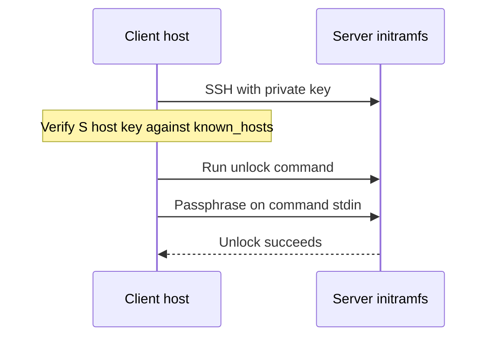

# Unlock an encrypted Linux server over SSH

[](https://github.com/bonnetn/remote-luks-unlocker/actions/workflows/ci.yml)
[](https://github.com/bonnetn/remote-luks-unlocker/blob/main/LICENSE)
[](https://github.com/bonnetn/remote-luks-unlocker/releases)
[](https://crates.io/crates/remote-luks-unlocker)

`remote-luks-unlocker` is a small client for one job: send the LUKS
passphrase to a server that is waiting for it during boot.

This is for a headless Debian or Ubuntu server with an encrypted root disk.
The server starts Dropbear in its initramfs, you can reach that Dropbear
session over SSH, and the client runs the unlock command for you. It is useful
when a server has rebooted and nobody is there to type the passphrase at the
console.

The client does not set up LUKS, install Dropbear, or change your bootloader.
Set up the server first: [Dropbear initramfs setup](docs/dropbear-initramfs.md).

## TL;DR

Install it:

```sh
cargo install remote-luks-unlocker
```

Then run it with the server address, the SSH key, a verified initramfs
`known_hosts` file, and the LUKS passphrase:

```sh
remote-luks-unlocker \
  --host server.example.com \
  --port 2222 \
  --user root \
  --identity-file "$HOME/.ssh/remote-luks" \
  --known-hosts "$HOME/.config/remote-luks/known_hosts" \
  --command cryptroot-unlock \
  --luks-password "$REMOTE_LUKS_LUKS_PASSWORD"
```

Or run the published container:

```sh
podman run --rm \
  --user "$(id -u):$(id -g)" \
  -v "$HOME/.ssh/remote-luks:/run/ssh/id_ed25519:ro" \
  -v "$HOME/.config/remote-luks/known_hosts:/run/ssh/known_hosts:ro" \
  -e REMOTE_LUKS_HOST=server.example.com \
  -e REMOTE_LUKS_PORT=2222 \
  -e REMOTE_LUKS_USER=root \
  -e REMOTE_LUKS_IDENTITY_FILE=/run/ssh/id_ed25519 \
  -e REMOTE_LUKS_KNOWN_HOSTS=/run/ssh/known_hosts \
  -e REMOTE_LUKS_COMMAND=cryptroot-unlock \
  -e REMOTE_LUKS_LUKS_PASSWORD \
  ghcr.io/bonnetn/remote-luks-unlocker
```

See [server setup](docs/dropbear-initramfs.md) before trying this on a real
machine.

## Quick start

This example assumes the server already has `dropbear-initramfs` configured,
listens on port `2222` during initramfs, and accepts the public key in
`~/.ssh/remote-luks.pub`.

Create a separate `known_hosts` file for the initramfs host key. Get the
fingerprint from the server console or your hosting provider first. Do not
treat `ssh-keyscan` by itself as verification.

```sh
mkdir -p "$HOME/.config/remote-luks"
ssh-keyscan -p 2222 server.example.com \
  > "$HOME/.config/remote-luks/known_hosts"
chmod 600 "$HOME/.config/remote-luks/known_hosts"
ssh-keygen -lf "$HOME/.config/remote-luks/known_hosts"
```

Start the client before, or just after, rebooting the server:

```sh
remote-luks-unlocker \
  --host server.example.com \
  --port 2222 \
  --user root \
  --identity-file "$HOME/.ssh/remote-luks" \
  --known-hosts "$HOME/.config/remote-luks/known_hosts" \
  --command cryptroot-unlock \
  --luks-password "$REMOTE_LUKS_LUKS_PASSWORD"
```

It keeps trying while SSH is unavailable. When SSH comes up, it authenticates,
sends the passphrase to `cryptroot-unlock`, and exits when the command reports
success.

## What the client does

The flow is simple:



1. Run the system OpenSSH `ssh` client.
2. Check the server key against the required `known_hosts` file.
3. Authenticate with the supplied private key. SSH password authentication is
   disabled.
4. Run the remote command and write the LUKS passphrase to its standard input.
5. Retry temporary SSH transport failures until the unlock succeeds.

The default command is `unlock-luks unlock`, which is intended for a small
server-side wrapper. Debian-family initramfs setups normally use
`--command cryptroot-unlock`.

## Server setup

See [Dropbear initramfs setup](docs/dropbear-initramfs.md) for a practical
Debian/Ubuntu example. It covers the parts that are easy to get wrong:

- installing `cryptsetup-initramfs` and `dropbear-initramfs`;
- adding a dedicated SSH key with a forced unlock command;
- getting the network driver and network configuration into the initramfs;
- rebuilding the initramfs; and
- using the initramfs host key, rather than the normal system SSH host key.

The guide links to the [Debian cryptsetup initramfs
documentation](https://cryptsetup-team.pages.debian.net/cryptsetup/README.initramfs.html),
[Debian's remote root unlock notes](https://cryptsetup-team.pages.debian.net/cryptsetup/README.Debian.html#_remotely_unlock_encrypted_rootfs),
and the [Dropbear initramfs package
documentation](https://sources.debian.org/src/dropbear/2018.76-5%2Bdeb10u1/debian/README.initramfs/).

## Docker or Podman

The container includes the client and OpenSSH. Mount both key files read-only:

```sh
podman run --rm \
  --user "$(id -u):$(id -g)" \
  -v "$HOME/.ssh/remote-luks:/run/ssh/id_ed25519:ro" \
  -v "$HOME/.config/remote-luks/known_hosts:/run/ssh/known_hosts:ro" \
  -e REMOTE_LUKS_HOST=server.example.com \
  -e REMOTE_LUKS_PORT=2222 \
  -e REMOTE_LUKS_USER=root \
  -e REMOTE_LUKS_IDENTITY_FILE=/run/ssh/id_ed25519 \
  -e REMOTE_LUKS_KNOWN_HOSTS=/run/ssh/known_hosts \
  -e REMOTE_LUKS_COMMAND=cryptroot-unlock \
  -e REMOTE_LUKS_LUKS_PASSWORD \
  ghcr.io/bonnetn/remote-luks-unlocker
```

Replace `podman` with `docker` if that is what you use.

## Security

The client verifies the SSH host key and uses public-key authentication. Keep
those two checks enabled. In particular, do not replace `known_hosts` with
`/dev/null` or add `StrictHostKeyChecking=no` just to make a first connection
work.

Use a key made only for this purpose. In the server's `authorized_keys`, limit
it to the unlock command and disable port forwarding, agent forwarding, X11
forwarding, and PTY allocation. Put the initramfs SSH port on a management
network or firewall it to trusted sources.

The passphrase is needed in memory on both sides. The client sends it to the
remote command on standard input; it is not used as the SSH password. Passing
it as a command-line argument or environment variable can expose it to local
process inspection, so use a secret manager or a tightly controlled client
host. Never commit it to a script or repository.

Keep console or provider recovery access and test a complete reboot before
depending on unattended reboots. LUKS does not protect an unencrypted
`/boot`, the initramfs, firmware, or a machine that is already running.

## Configuration

Every option is also available as an environment variable. Run
`remote-luks-unlocker --help` for the full list.

| Option | Environment variable | Default |
| --- | --- | --- |
| `--host` | `REMOTE_LUKS_HOST` | required |
| `--port` | `REMOTE_LUKS_PORT` | `22` |
| `--user` | `REMOTE_LUKS_USER` | required |
| `--identity-file` | `REMOTE_LUKS_IDENTITY_FILE` | required |
| `--known-hosts` | `REMOTE_LUKS_KNOWN_HOSTS` | required |
| `--luks-password` | `REMOTE_LUKS_LUKS_PASSWORD` | required |
| `--command` | `REMOTE_LUKS_COMMAND` | `unlock-luks unlock` |
| `--interval-seconds` | `REMOTE_LUKS_INTERVAL_SECONDS` | `1` |
| `--attempt-timeout-seconds` | `REMOTE_LUKS_ATTEMPT_TIMEOUT_SECONDS` | `30` |

## Troubleshooting

- **No SSH connection:** check the server console, initramfs network settings,
  NIC driver, port, and firewall before debugging the client.
- **Host-key error:** the initramfs usually has a different host key from the
  normal operating system. Use a separate, verified `known_hosts` file.
- **Public-key authentication error:** check the complete public key,
  permissions, username, and the key path used by Dropbear. Rebuild the
  initramfs after changing its files.
- **SSH works but unlock fails:** run the command manually and check the
  `crypttab` mapping and `cryptroot-unlock` output. Multiple encrypted devices
  may need more than one unlock attempt.
- **Need more client detail:** set `RUST_LOG=remote_luks_unlocker=debug`.

## Compatibility and development

The tested client environment is a Unix-like host with the system OpenSSH
`ssh` executable. The repository tests use a rootless Podman Dropbear fixture;
they do not attach a privileged LUKS device. The server guide targets Debian
and Ubuntu with `initramfs-tools`. Other distributions and initramfs
generators may work, but their setup is not tested here.

See [`CONTRIBUTING.md`](CONTRIBUTING.md) for tests, container checks, and
development details.

## License

MIT. See [`LICENSE`](LICENSE).
