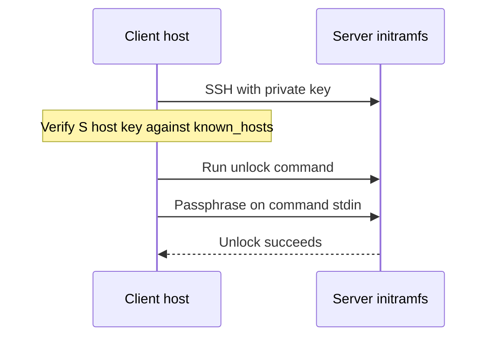

# Unlock an encrypted Linux server over SSH

[](https://github.com/bonnetn/remote-luks-unlocker/actions/workflows/ci.yml)
[](https://github.com/bonnetn/remote-luks-unlocker/blob/main/LICENSE)
[](https://github.com/bonnetn/remote-luks-unlocker/releases)
[](https://crates.io/crates/remote-luks-unlocker)

`remote-luks-unlocker` is a small client for one job: send the LUKS
passphrase to a server that is waiting for it during boot.

This is for a headless Debian or Ubuntu server with an encrypted root disk.
The server starts Dropbear in its initramfs, you can reach that Dropbear
session over SSH, and the client runs the unlock command for you. It is useful
when a server has rebooted and nobody is there to type the passphrase at the
console.

The client does not set up LUKS, install Dropbear, or change your bootloader.
Set up the server first: [Dropbear initramfs setup](docs/dropbear-initramfs.md).

## TL;DR

Install it:

```sh
cargo install remote-luks-unlocker
```

Then run it with the server address, the SSH key, a verified initramfs
`known_hosts` file, and the LUKS passphrase:

```sh
remote-luks-unlocker \
  --host server.example.com \
  --port 2222 \
  --user root \
  --identity-file "$HOME/.ssh/remote-luks" \
  --known-hosts "$HOME/.config/remote-luks/known_hosts" \
  --command cryptroot-unlock \
  --luks-password "$REMOTE_LUKS_LUKS_PASSWORD"
```

Or run the published container:

```sh
podman run --rm \
  --user "$(id -u):$(id -g)" \
  -v "$HOME/.ssh/remote-luks:/run/ssh/id_ed25519:ro" \
  -v "$HOME/.config/remote-luks/known_hosts:/run/ssh/known_hosts:ro" \
  -e REMOTE_LUKS_HOST=server.example.com \
  -e REMOTE_LUKS_PORT=2222 \
  -e REMOTE_LUKS_USER=root \
  -e REMOTE_LUKS_IDENTITY_FILE=/run/ssh/id_ed25519 \
  -e REMOTE_LUKS_KNOWN_HOSTS=/run/ssh/known_hosts \
  -e REMOTE_LUKS_COMMAND=cryptroot-unlock \
  -e REMOTE_LUKS_LUKS_PASSWORD \
  ghcr.io/bonnetn/remote-luks-unlocker
```

See [server setup](docs/dropbear-initramfs.md) before trying this on a real
machine.

## Quick start

This example assumes the server already has `dropbear-initramfs` configured,
listens on port `2222` during initramfs, and accepts the public key in
`~/.ssh/remote-luks.pub`.

Create a separate `known_hosts` file for the initramfs host key. Get the
fingerprint from the server console or your hosting provider first. Do not
treat `ssh-keyscan` by itself as verification.

```sh
mkdir -p "$HOME/.config/remote-luks"
ssh-keyscan -p 2222 server.example.com \
  > "$HOME/.config/remote-luks/known_hosts"
chmod 600 "$HOME/.config/remote-luks/known_hosts"
ssh-keygen -lf "$HOME/.config/remote-luks/known_hosts"
```

Start the client before, or just after, rebooting the server:

```sh
remote-luks-unlocker \
  --host server.example.com \
  --port 2222 \
  --user root \
  --identity-file "$HOME/.ssh/remote-luks" \
  --known-hosts "$HOME/.config/remote-luks/known_hosts" \
  --command cryptroot-unlock \
  --luks-password "$REMOTE_LUKS_LUKS_PASSWORD"
```

It keeps trying while SSH is unavailable. When SSH comes up, it authenticates,
sends the passphrase to `cryptroot-unlock`, and exits successfully when the
remote command returns success.

## What the client does

The client does this:



- Uses the system `ssh` command.
- Checks the server key.
- Logs in with the private key. SSH password login is off.
- Runs the unlock command.
- Sends the LUKS passphrase to the command's standard input.
- Keeps retrying while the server is down.

The default command is `unlock-luks unlock`. For Debian or Ubuntu
`dropbear-initramfs`, use `--command cryptroot-unlock`.

## Run it with systemd

For unattended operation, run the client as a systemd service. The client
already waits and retries. Put the environment variables in a protected
`EnvironmentFile`; do not put the passphrase directly in the unit file.

Create `/etc/systemd/system/remote-luks-unlocker.service`:

```ini
[Unit]
Description=Unlock remote LUKS server
Wants=network-online.target
After=network-online.target

[Service]
Type=simple
User=remote-luks
EnvironmentFile=/etc/remote-luks-unlocker/environment
ExecStart=/usr/local/bin/remote-luks-unlocker
Restart=on-failure
RestartSec=5s
NoNewPrivileges=true
PrivateTmp=true
ProtectSystem=strict
ProtectHome=true

[Install]
WantedBy=multi-user.target
```

Then enable it:

```sh
sudo systemctl daemon-reload
sudo systemctl enable --now remote-luks-unlocker.service
```

Use a dedicated service account and protect the private key, `known_hosts`,
and environment file. Check the logs with `journalctl` before testing a
reboot.

## Server setup

See [Dropbear initramfs setup](docs/dropbear-initramfs.md). It covers:

- installing `cryptsetup-initramfs` and `dropbear-initramfs`;
- adding a restricted SSH key;
- setting up the initramfs network;
- rebuilding the initramfs; and
- checking the initramfs host key.

The guide links to the [Debian cryptsetup initramfs
documentation](https://cryptsetup-team.pages.debian.net/cryptsetup/README.initramfs.html),
[Debian's remote root unlock notes](https://cryptsetup-team.pages.debian.net/cryptsetup/README.Debian.html#_remotely_unlock_encrypted_rootfs),
and the [Dropbear initramfs package
documentation](https://sources.debian.org/src/dropbear/2018.76-5%2Bdeb10u1/debian/README.initramfs/).

## Docker or Podman

The image includes the client and OpenSSH. Mount both key files read-only:

```sh
podman run --rm \
  --user "$(id -u):$(id -g)" \
  -v "$HOME/.ssh/remote-luks:/run/ssh/id_ed25519:ro" \
  -v "$HOME/.config/remote-luks/known_hosts:/run/ssh/known_hosts:ro" \
  -e REMOTE_LUKS_HOST=server.example.com \
  -e REMOTE_LUKS_PORT=2222 \
  -e REMOTE_LUKS_USER=root \
  -e REMOTE_LUKS_IDENTITY_FILE=/run/ssh/id_ed25519 \
  -e REMOTE_LUKS_KNOWN_HOSTS=/run/ssh/known_hosts \
  -e REMOTE_LUKS_COMMAND=cryptroot-unlock \
  -e REMOTE_LUKS_LUKS_PASSWORD \
  ghcr.io/bonnetn/remote-luks-unlocker
```

Use `docker` instead of `podman` if needed.

## Security

Keep host-key checking on. Do not use `/dev/null` for `known_hosts`. Do not use
`StrictHostKeyChecking=no`.

Use a key made only for this job. Restrict it in `authorized_keys` to the
unlock command. Disable forwarding and PTY access. Firewall the initramfs SSH
port to a management network.

The client sends the passphrase to the remote command on standard input. It is
not the SSH password. The passphrase is in memory on the client and server.
Do not put it in source control. Protect the environment file if you use the
systemd setup above.

Keep console or provider recovery access. Test a full reboot before relying on
this. LUKS does not protect an unencrypted `/boot`, the initramfs, firmware, or
a running machine.

## Configuration

Every option is also available as an environment variable. Run
`remote-luks-unlocker --help` for the full list.

| Option | Environment variable | Default |
| --- | --- | --- |
| `--host` | `REMOTE_LUKS_HOST` | required |
| `--port` | `REMOTE_LUKS_PORT` | `22` |
| `--user` | `REMOTE_LUKS_USER` | required |
| `--identity-file` | `REMOTE_LUKS_IDENTITY_FILE` | required |
| `--known-hosts` | `REMOTE_LUKS_KNOWN_HOSTS` | required |
| `--luks-password` | `REMOTE_LUKS_LUKS_PASSWORD` | required |
| `--command` | `REMOTE_LUKS_COMMAND` | `unlock-luks unlock` |
| `--interval-seconds` | `REMOTE_LUKS_INTERVAL_SECONDS` | `1` |
| `--attempt-timeout-seconds` | `REMOTE_LUKS_ATTEMPT_TIMEOUT_SECONDS` | `30` |

## Troubleshooting

- **No SSH:** check the console, initramfs network, NIC driver, port, and
  firewall.
- **Host-key error:** the initramfs usually has a different key from the normal
  system. Use a separate verified `known_hosts` file.
- **Key rejected:** check the public key, file permissions, username, and key
  path. Rebuild the initramfs after changing Dropbear files.
- **Unlock fails:** run the command manually. Check `crypttab` and
  `cryptroot-unlock`. More than one encrypted device may need more than one
  unlock.
- **More client logs:** set `RUST_LOG=remote_luks_unlocker=debug`.

## Compatibility and development

The client needs a Unix-like host with the system OpenSSH `ssh` command. The
server guide targets Debian and Ubuntu with `initramfs-tools`. Other systems
may work, but are not tested here. The repository's Podman fixture tests SSH
and the unlock command; it does not attach a real LUKS device.

See [`CONTRIBUTING.md`](CONTRIBUTING.md) for tests, container checks, and
development details.

## License

MIT. See [`LICENSE`](LICENSE).
